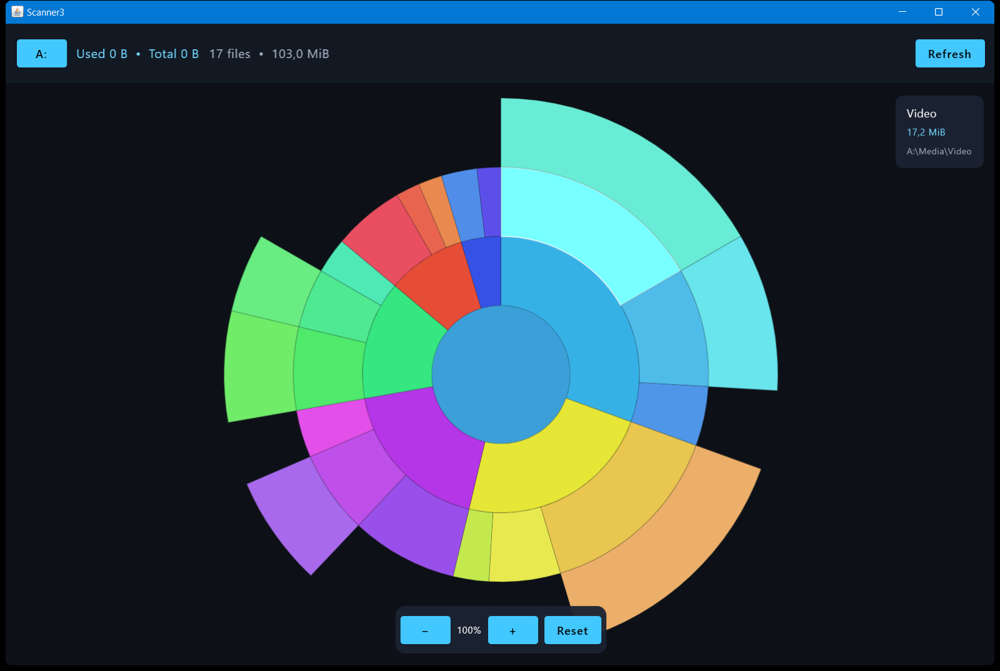

# Scanner3

Desktop-визуализатор занятого места на диске в стиле DaisyDisk. Приложение сканирует выбранный том и строит полноуровневую sunburst-карту каталогов.



## Возможности

- выбор доступного диска;
- отображение занятого и общего объёма диска;
- рекурсивное сканирование каталогов без перехода по символическим ссылкам;
- полноуровневая круговая карта, где размер сектора пропорционален размеру каталога;
- отдельные базовые цвета корневых ветвей с наследованием оттенка потомками;
- название, размер и полный путь при наведении;
- масштабирование колесом мыши или кнопками `−`, `+`, `Reset`;
- контекстное меню по клику на сектор:
  - открыть каталог в Explorer/Finder;
  - переместить каталог в системную корзину;
  - удалить каталог безвозвратно;
- автоматическое повторное сканирование после удаления;
- оптимизированная отрисовка больших деревьев: кэширование геометрии, отсечение субпиксельных секторов и отключение тяжёлой анимации для очень больших карт.

## Требования

- JDK 17 или новее;
- Windows или macOS;
- подключение к интернету при первой сборке для загрузки Gradle-зависимостей.

Проект использует Kotlin 2.1.21, Compose Multiplatform 1.8.2 и Gradle 8.10.

## Запуск

Windows:

```bat
gradlew.bat run
```

macOS/Linux:

```bash
./gradlew run
```

## Сборка JAR

Windows:

```bat
gradlew.bat clean jar
```

macOS/Linux:

```bash
./gradlew clean jar
```

Результат создаётся в `build/libs/scanner3.jar`.

## Управление

1. Нажмите **Choose a disk** и выберите диск.
2. Дождитесь завершения сканирования. Счётчик файлов и найденный объём обновляются в верхней панели.
3. Наведите курсор на сектор, чтобы увидеть каталог, размер и путь.
4. Кликните сектор для открытия контекстного меню.
5. Используйте колесо мыши либо кнопки масштаба в нижней части окна.

## Удаление

- **Move to Trash** использует системную корзину через Java Desktop API. Если операционная система не поддерживает корзину для выбранного пути, приложение покажет ошибку и не удалит каталог.
- **Delete** удаляет каталог и всё содержимое безвозвратно. Перед операцией показывается обязательное подтверждение с полным путём.
- Удаление и перемещение в корзину корня диска запрещены.
- После успешной операции карта автоматически перестраивается.

## Ограничения сканирования

- Символические ссылки пропускаются, чтобы избежать циклов и выхода за пределы выбранного дерева.
- Недоступные файлы и каталоги пропускаются; такой участок отмечается как `partial scan`.
- Количество каталогов ограничено 100 000. При достижении лимита соответствующая ветвь считается частично просканированной.

## Структура исходников

- `scanner3/Main.kt` — окно приложения, сканирование и обновление состояния;
- `scanner3/scan/DiskScanner.kt` — обход файловой системы;
- `scanner3/render/SunburstModel.kt` — геометрия секторов и hit testing;
- `scanner3/ui/SunburstView.kt` — Canvas, hover, меню и масштабирование;
- `scanner3/ui/DiskPicker.kt` — выбор диска и статус;
- `scanner3/platform/OS.kt` — диски, Explorer/Finder, корзина и удаление;
- `scanner3/model/FolderNode.kt` — модель дерева каталогов.
